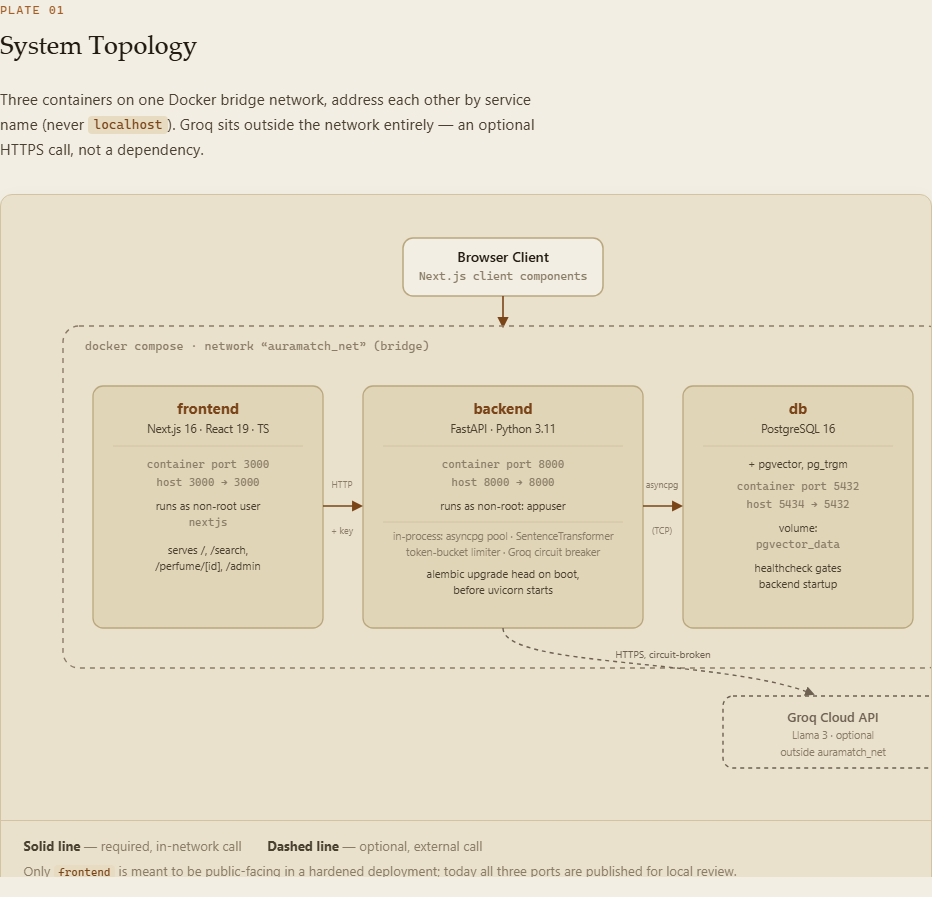
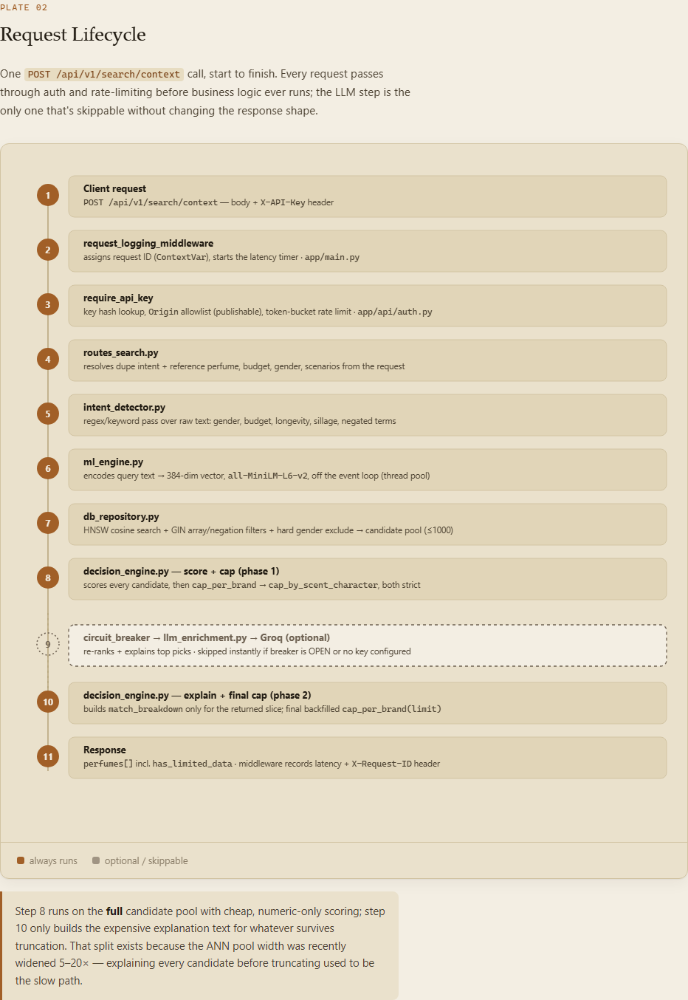
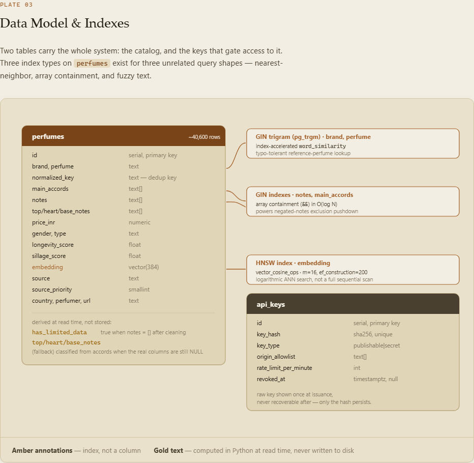
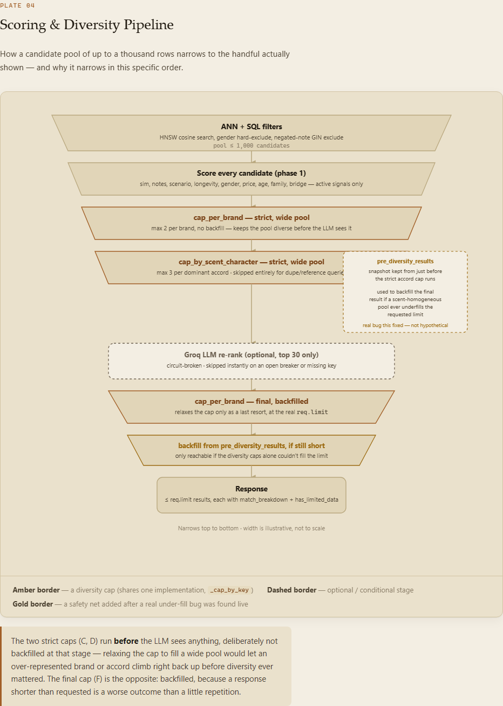

# AuraMatch AI - Olfactory Matching & Suggestion Platform

## Project Submission Deliverables

To ensure consistency in the evaluation process per the JTP submission guidelines, the core deliverables are linked below:

| Deliverable | Contents |
| :--- | :--- |
| **[Installation & Setup Guide](INSTALLATION_GUIDE.md)** | Step-by-step instructions for running the application using Docker Compose, configuring environment files, and seeding the database. |
| **[User Manual](USER_MANUAL.md)** | Guide to navigating the Vibe Check, Dupe Finder, and scent pyramids, plus accessing the Developer Metrics Dashboard. |
| **[Project Documentation Hub](documentation/README.md)** | Technical specifications, engineering details, testing blueprints, and API key setup. |

---

AuraMatch AI is a semantic fragrance matching and recommendation application. It translates natural language context (such as, "I need a fresh summer scent for the office commute that projects well") into high-dimensional vector embeddings, conducting similarity queries against a database of over 40,000 scents to identify optimal fragrance choices and budget-friendly alternatives.

---

## 1. Project Motivation and Technical Novelty

### 1.1 Why This Project?
Traditional retail search systems rely on simple keyword matches (e.g. tag containment searches). This approach fails to capture the complex, subjective, and layered properties of fragrance profiles. AuraMatch AI solves this by combining semantic vector searching with a deterministic olfactory decision engine. The platform goes beyond simple nearest-neighbor calculations, evaluating candidate profiles on budget metrics, volatility constraints, gender indicators, and scent notes.

### 1.2 What Makes It Special?
*   **Decoupled Semantic Retrieval**: The core application runs embedding generation locally using `all-MiniLM-L6-v2`. This design handles matching without mandatory external LLM API dependencies, allowing the application to run fully offline.
*   **Fail-Safe LLM Re-Ranking**: If a Groq API key is available, an enrichment layer format prompts to generate natural language explanations. This layer is protected by a circuit breaker; if the external API times out or fails, the engine falls back to the deterministic match results instantly with zero user-facing latency.
*   **Priority-Based Ingestion**: The system handles duplicate records using case-insensitive normalized keys and source-priority hierarchies. Highly curated listings automatically override lower-quality batch CSV imports during upserts.
*   **Schema Migration Safety**: Schema modifications are tracked dynamically via Alembic migrations, allowing database structures to evolve without data loss.

---

## 2. Core Architecture and Component Layout

AuraMatch AI is built using a decoupled containerized model running on a custom Docker bridge network (`auramatch_net`).

| Tier | Component | Description |
| :--- | :--- | :--- |
| **Presentation** | Next.js 14 Web Application | Built with React, TypeScript, and TailwindCSS. Offers interfaces for context search, details, and duplicate finding. |
| **Application** | FastAPI Backend API | Written in Python 3.11, using Pydantic validation, asyncpg database pools, and locally hosted SentenceTransformers. |
| **Persistence** | PostgreSQL 16 + pgvector | Self-contained vector database, pre-loaded with over 40,000 fragrances and optimized with HNSW indices. |
| **Orchestration**| Docker Compose | Coordinates multi-container network boundaries and environment variables. |

### Architecture, illustrated

<p>
  
  
</p>
<p>
  
  
</p>

The full interactive version - same four diagrams, scrollable, with captions - lives at [`documentation/architecture-diagram.html`](documentation/architecture-diagram.html); open it directly in a browser (no server needed).

For detailed system specs, refer to:
*   [System Architecture Guide](documentation/SYSTEM_ARCHITECTURE.md)
*   [Decision Engine Scoring Logic Guide](documentation/DECISION_ENGINE.md)
*   [Data Ingestion and Schema Migrations Guide](documentation/DATA_INGESTION_PIPELINE.md)
*   [Third-Party API Integration Guide](documentation/THIRD_PARTY_API.md)
*   [Testing & Observability Guide](documentation/TESTING_AND_OBSERVABILITY.md)
*   [Groq LLM Setup & Configuration Guide](documentation/GROQ_SETUP.md)

---

## 3. How to Run the Application (Plug and Play)

AuraMatch AI is fully self-contained. No external API keys or cloud credentials are required to start the system.

### 3.1 Step 1: Clone the Repository
```bash
git clone https://github.com/shriyashsawant/JTP-PROJECT-ROUND.git
cd JTP-PROJECT-ROUND
```

### 3.2 Step 2: Spin Up Containers
```bash
docker compose up --build -d
```
*   **Note**: The database container is pre-loaded with schema configurations and seeding files, auto-loading 40K+ perfumes on first boot. The backend container applies any pending database migrations automatically on startup before serving requests - no manual migration step is required.
*   First boot restores ~40K rows and can take several minutes depending on disk speed; subsequent restarts are fast since the data persists in a Docker volume.
*   **You do not need to run anything else to populate data** - `backend/seed_data.py` is a one-time dev-time tool used to originally assemble the pre-loaded snapshot above; it is not part of this startup flow, is not run automatically, and (unlike everything above) some of its optional data sources require Kaggle API credentials to re-run from scratch. A plain `docker compose up` never touches it.

### 3.3 Step 3: Access the Interfaces
*   **Web Portal**: [http://localhost:3000](http://localhost:3000) - the intended way to use the app; no API key needed, the frontend handles this internally (see §7).
*   **Swagger API Documentation**: [http://localhost:8000/docs](http://localhost:8000/docs) - browsable schema reference. To actually call `/search/context`, `/search/dupe`, or `/perfume/{id}` here (via "Try it out"), you need an API key first - see §7.

### 3.4 Step 4: Configure Groq LLM Re-Ranking (Optional)
To enable the AI-powered natural language explanations:
1. **Locate the Project Root Directory**: Ensure you are in the main project folder (`JTP-PROJECT-ROUND/` which contains `docker-compose.yml`, `backend/`, and `frontend/`).
2. **Create the Environment File**:
   * **Exact Name**: The file must be named exactly `.env` (with a leading dot and no file extension like `.txt` or `.env.txt`).
   * **Exact Path**: `JTP-PROJECT-ROUND/.env`
3. **Configure the API Key**: Open the `.env` file in a text editor and add the following line:
   ```env
   GROQ_API_KEY=gsk_your_groq_api_key_here
   ```
4. **Apply Changes**: Spin up or restart the containers so that Docker Compose picks up the `.env` variables:
   ```bash
   docker compose up -d
   ```
For troubleshooting and verification steps, see the full [Groq LLM Setup Guide](documentation/GROQ_SETUP.md).

---

## 4. Ingestion Data Structure

The ingestion pipeline deduplicates and processes data from the following declared public datasets:
1.  **DA Fragrance Analysis**: 38,000 rows containing detailed accords and ingredients (public dataset).
2.  **Fragrantica Dataset (Kaggle: olgagmiufana1/fragrantica-com-fragrance-dataset)**: 24,000 rows containing structured top, heart, and base notes.
3.  **Nandini Perfumes (Kaggle: nandini1999/perfume-recommendation-dataset)**: 2,200 rows containing image links and product descriptions.
4.  **Indian Brand Mainstream Supplement**: Curated brand and pricing data.

*   **Pricing**: Prices are normalized into INR (₹) using brand-tier estimates (ranging from luxury designers to local brands).
*   **Longevity/Sillage**: Generated at ingestion using position-weighted accord profiles. Heavier accords (leather, woods) receive higher longevity weights, while highly volatile notes (citrus, green) receive lower weights.
*   **Data quality is surfaced, not hidden**: a minority of rows (mostly older, pre-pipeline `legacy_seed` records) have no verified note pyramid - their `top_notes`/`heart_notes`/`base_notes` are inferred from `main_accords` at request time (`db_repository._resolve_pyramid`) rather than left blank. Every API response carries a `has_limited_data` flag for exactly this case, and the web UI shows a small "notes inferred from accords" notice on those results instead of silently presenting an inferred pyramid as verified fact.

---

## 5. API Reference Endpoints

| Method | Endpoint | Description |
| :--- | :--- | :--- |
| `POST` | `/api/v1/search/context` | Evaluates natural language query inputs along with explicit scenario and filter preferences. |
| `POST` | `/api/v1/search/dupe` | Identifies affordable alternative scents within the specified budget limits. |
| `GET` | `/api/v1/perfume/{id}` | Returns metadata, sillage/longevity scores, and scent pyramids for a selected perfume. |
| `GET` | `/api/v1/health` | Verifies database connectivity. |
| `GET` | `/metrics` | Prometheus scrape target - HTTP latency/error rates, DB pool utilization, circuit-breaker state, rate-limit rejections. Unauthenticated, same convention as `/health`. |

---

## 6. QA Verification and Testing

The application is validated by a test suite comprising **287 unit and integration tests** covering matching logic, intent detection, circuit breaker/rate-limiter operations, API key authentication, schemas, database fallbacks, and observability metrics.

To execute tests locally:
```bash
cd backend
.venv\Scripts\python -m pytest
```

Mypy type checking and Ruff lint configurations are fully clean across core service files.

---

## 7. Authenticating API Requests

Every search/lookup endpoint (`/search/context`, `/search/dupe`, `/perfume/{id}`) requires an `X-API-Key` header - `/health` is the only exception. The web portal already has its own key baked in at build time, so using [http://localhost:3000](http://localhost:3000) works with no extra steps.

To call the API directly (via `curl`, Postman, or Swagger's "Try it out"), issue yourself a key first:
```bash
cd backend
python scripts/issue_api_key.py --type secret --label "manual testing" --rate-limit 300
```
This prints a raw key once (save it - it can't be recovered afterward). Send it as `X-API-Key: <key>` on each request. Full details - the publishable-vs-secret key model, rate limits, and error format - are in [documentation/THIRD_PARTY_API.md](documentation/THIRD_PARTY_API.md).


