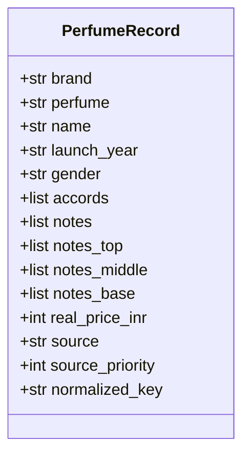

# AuraMatch AI - Data Ingestion & Migration Pipeline Guide

This document details the database migration patterns, quality validation boundaries, and priority-based upsert execution engines powering AuraMatch AI's data ingestion pipeline.

---

## 1. Algorithmic Overview and Data Integrity Challenges

AuraMatch AI has evolved from a statically seeded project into a system built to ingest data from diverse, live sources (including batch imports, partner API feeds, and user submissions). This transition introduces several key data integrity challenges:
*   **Schema Evolution**: Schema modifications must be applied to live, active databases without destroying user accounts, transaction histories, or existing data.
*   **Duplicate Detection**: Minor variations in casing, spacing, and punctuation (e.g. "Dior" vs "DIOR ") must be resolved to a single logical record.
*   **Data Corruption**: Ingestion pipelines must prevent low-quality, automated imports or unverified CSV uploads from overwriting curated datasets.
*   **Reseeding Latency**: Generating vector embeddings for 40K+ rows takes hours. Ingestion pipelines must support incremental updates (only re-embedding when text-affecting fields actually change).

---

## 2. Schema Evolution and Database Migrations (Alembic)

Database schema alterations are managed dynamically through Alembic to support live production environments:
*   `backend/alembic.ini`: Configures execution parameters, log formatting, and file generation templates.
*   `backend/app/db/migrations/env.py`: Integrates with the application settings. It extracts the PostgreSQL credentials dynamically at runtime using the application configuration class, avoiding hardcoded duplicate strings.
*   `backend/app/db/migrations/versions/`: Contains the migration transaction scripts.

### 2.1 Schema Version Timeline
*   `0001_baseline.py`: Freezes the core database table schemas (matching the original structure defined in `01_schema.sql`). This is used as the fresh-install bootstrap.
*   `0002_ingestion_columns.py`: Adds metadata columns to the `perfumes` table: `source` (TEXT), `source_priority` (SMALLINT), and `model_version` (TEXT). These columns are required to run priority-based upserts.
*   `0003_normalized_key.py`: Appends a `normalized_key` (TEXT) column and its associated index. This column stores case-insensitive, punctuation-stripped brand-and-perfume representations to accelerate duplicate matches.

---

## 3. Ingestion Boundary Contract and Validation

All incoming data sources must be normalized into a strict, validated Python interface before interacting with the database.



### 3.1 Pydantic Validation Boundary (`contracts.py`)
The `PerfumeRecord` class defines the input contract. Pydantic validates fields at runtime:
*   Rejects blank or missing `brand` and `perfume` values.
*   Converts array elements and floats to correct types, preventing database insertion type mismatch errors.
*   Computes the `normalized_key` property dynamically using a unified normalization routine (`normalize_name`), which acts as the single source of truth for both Python and database checks.

### 3.2 Ingestion Quality Gating (`validators.py`)
`validate_record()` performs business-logic checks and logs issues without raising fatal exceptions:
*   Verifies that `real_price_inr` is positive if provided (flags $\le 0$).
*   Flags blank elements or empty strings inside the `accords` and `notes` arrays.
*   Validates that the rating is within the 0 to 5 range, and rating counts are non-negative.

---

## 4. Priority-Based Conditional Upserts (`upsert.py`)

To prevent updates from being silently ignored or curated data from being corrupted, the engine implements a priority-based upsert process inside `app/ingestion/upsert.py`.

### 4.1 Ingestion Source Hierarchy
Each ingestion source is assigned a priority score (`seed_data.SOURCE_PRIORITY`, shared by the batch dedup pass and the persisted `source_priority` column so both agree on the same ordering):
*   `curated_merged` (Priority 5): our own enriched dataset - the only source with 100% real accord coverage and a genuine (not inferred) note pyramid.
*   `nandini` (Priority 4): niche perfumes with rich descriptions and images.
*   `fra_cleaned` (Priority 3): curated notes dataset with real per-tier note tags.
*   `fra_perfumes` (Priority 2): the larger, broader notes dataset.
*   `da_fragrance` (Priority 1): the base olfactory dataset.
*   `indian_brands` and any other/unrecognized source (Priority 0, the `SOURCE_PRIORITY.get(source, 0)` default): the hand-curated Indian mass-market supplement, and legacy rows backfilled to `source='legacy_seed'` by migration `0002_ingestion_columns`.

### 4.2 Duplicate Matching Workflow
When a new record is ingested:
1.  **Exact Match Search**: The database is queried for a record with the exact `brand` and `perfume` values.
2.  **Normalized Match Search**: If no exact match is found, the database is queried for a record with a matching `normalized_key`.
    *   If a single row matches, it is treated as a duplicate (resolving variations like casing or punctuation).
    *   If multiple rows match the same normalized key, it is treated as ambiguous (e.g. distinct sizing/SKU variations). The engine inserts a new row instead of guessing which record to update.
3.  **Priority Evaluation**: If an existing row is found, the engine compares priorities:
    *   If `record.source_priority < existing_priority`, the upsert is skipped, preserving the curated data.
    *   If `record.source_priority >= existing_priority`, the engine executes an `UPDATE` query.

### 4.3 Update Query Execution
```sql
UPDATE perfumes SET
    launch_year = $2, gender = COALESCE($3, gender),
    main_accords = $4, notes = $5,
    embedding = COALESCE($6::vector, embedding),
    price_inr = COALESCE($7, price_inr),
    image_url = COALESCE($8, image_url),
    longevity_score = $9, sillage_score = $10,
    url = COALESCE($11, url), country = COALESCE($12, country),
    perfumer = COALESCE($13, perfumer),
    top_notes = $14, heart_notes = $15, base_notes = $16,
    source = $17, source_priority = $18,
    normalized_key = $19, model_version = COALESCE($20, model_version)
WHERE id = $1
```
*   `COALESCE` is used on `embedding`, `price_inr`, and `image_url` to preserve existing values if the incoming record lacks them.

---

## 5. Automated Database Backups (`backup_db.sh`)

Schema migrations on live databases carry risk. To mitigate this, database backups are automated via `backend/scripts/backup_db.sh`.
*   **Command**:
    ```bash
    backend/scripts/backup_db.sh
    ```
    Internally: `docker compose exec -T db pg_dump -U auramatch -d auramatch | gzip > backend/backups/auramatch_<timestamp>.sql.gz` (the `-T` flag disables TTY allocation, required so `docker compose exec`'s stdout can be piped without corruption; output is gzipped, and `backend/backups/` is gitignored).
*   **Why**: Creates a compressed copy of the database before migrations run. Restore with `gunzip -c <file> | docker compose exec -T db psql -U auramatch -d auramatch` if errors occur.

---

## 6. Scope of Ingestion Scaling and Future Expansion

The ingestion pipeline is designed to support further scaling as ingestion volume increases:
*   **Asynchronous Message Queues**: Transitioning the batch ingestion loops to Celery tasks backed by RabbitMQ or Redis. This decouples file uploads or import triggers from the main web server processes.
*   **Automatic Quality Scoring**: Incorporating a data quality rating on incoming records based on the completeness of their note pyramids, description attributes, and image resolution, adjusting priorities dynamically before write operations.
