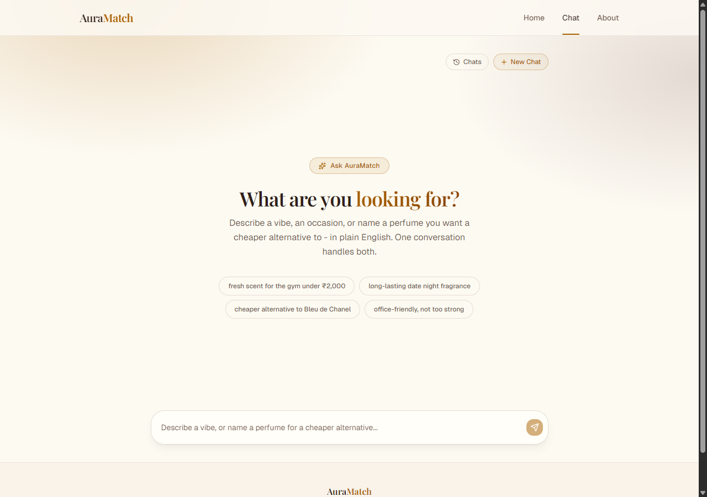
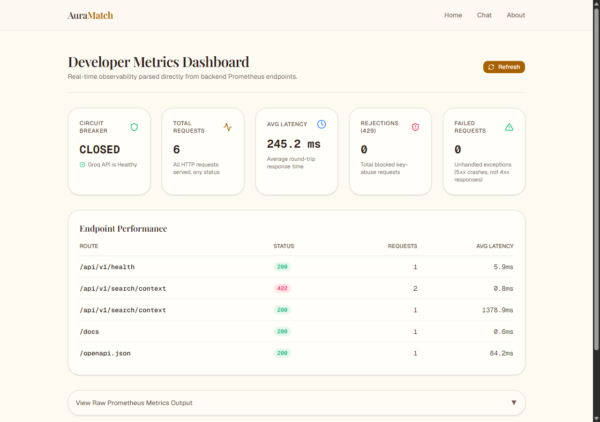
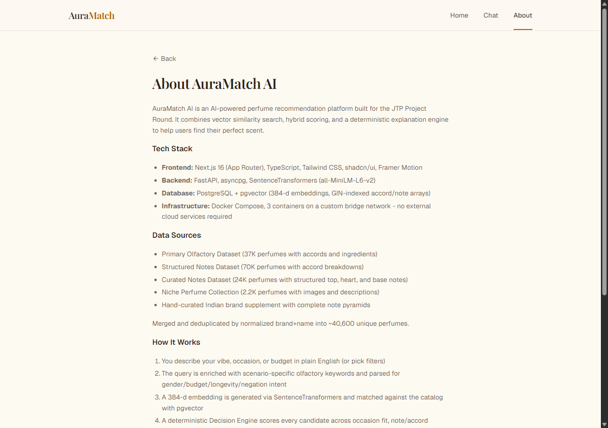
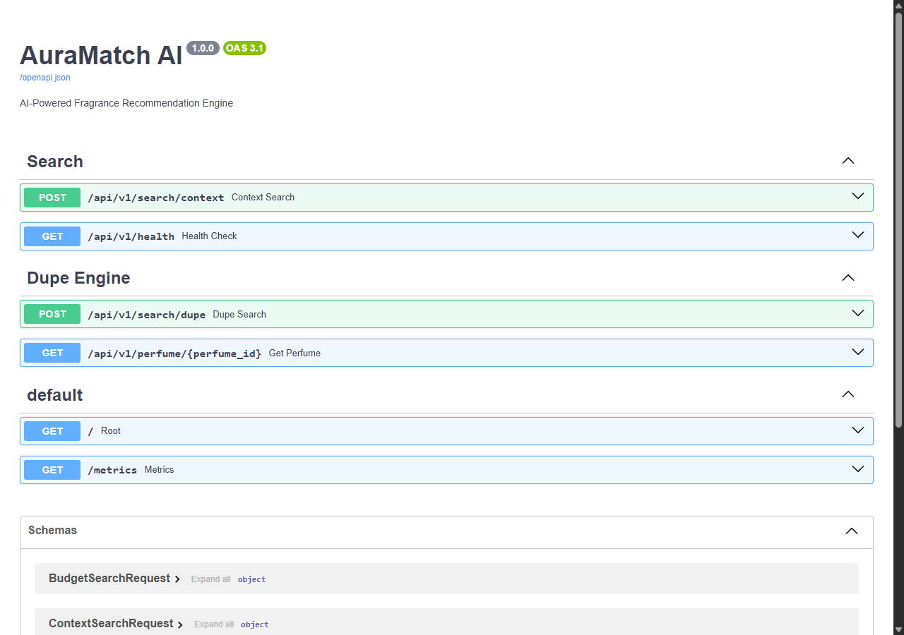

# AuraMatch AI — Documentation Audit Report

> **Date**: 2026-07-14
> **Reviewer**: AI-assisted documentation audit
> **Audience**: New users / Technical evaluators

---

## Executive Summary

This report evaluates all project documentation from the perspective of a **completely new user** — someone who has just cloned the repo and wants to understand, set up, and use AuraMatch AI with zero prior context.

**Verdict**: The documentation is **substantial and generally well-written** (10 markdown files across `documentation/`, plus the root `README.md`). However, several gaps exist that would frustrate or confuse a new user. The most critical issues are:

1. **No screenshots of the working web UI anywhere in the docs**
2. **No "verification" step after Docker setup** tells the user how to confirm everything is working
3. **No graceful-shutdown or update instructions**
4. **API key model is correct but confusingly spread across 4+ files**
5. **The frontend publishable key is hardcoded in the Dockerfile as a fallback example, but no `.env.local` template explains it for local-dev users**
6. **No troubleshooting for the most common Docker issues (volume reset, port conflicts, seed timeouts)**

---

## 1. Documentation Coverage Review

| Document | Covers Setup? | Covers Usage? | Covers Architecture? | Has Visuals? | New-User Friendly? |
|---|---|---|---|---|---|
| `README.md` (root) | ✅ Yes | ✅ Yes | ✅ Yes | ✅ 4 arch diagrams | ✅ Good summary |
| `Installation Guide` | ✅ Yes (excellent) | ❌ No | ❌ No | ❌ No | ✅ Very good |
| `User Manual` | ❌ No | ✅ Yes | ❌ No | ❌ **No screenshots of UI** | ⚠️ Missing visuals |
| `System Architecture` | ❌ No | ❌ No | ✅ Excellent | ✅ Arch diagrams | ⚠️ Very technical |
| `Decision Engine` | ❌ No | ❌ No | ✅ Excellent | ❌ No | ⚠️ Very technical |
| `Data Ingestion` | ❌ No | ❌ No | ✅ Excellent | ❌ No | ⚠️ Very technical |
| `Frontend Architecture` | ❌ No | ⚠️ Partial | ✅ Excellent | ❌ No | ⚠️ Developer-focused |
| `Third-Party API` | ⚠️ Partial | ✅ Yes | ✅ Yes | ❌ No | ✅ Good |
| `Testing & Observability` | ❌ No | ❌ No | ✅ Excellent | ✅ Mermaid diagram | ⚠️ Developer-focused |
| `Groq Setup` | ✅ Yes | ✅ Yes | ❌ No | ❌ No | ✅ Clear |

---

## 2. Critical Gaps (Showstoppers for New Users)

### Gap #1: [CRITICAL] No UI Screenshots

The documentation has **4 architecture diagrams** (topology, lifecycle, data model, pipeline) but **zero screenshots of the actual web application**. A new user sees:
- "Vibe Check (Conversational Matching)" described in text
- "Reading Scent Detail Cards" described as a table
- No visual of what the chat interface looks like
- No visual of what a search result card looks like
- No visual of the admin dashboard

**Files affected**: `USER_MANUAL.md`, `FRONTEND_ARCHITECTURE.md`

**Screenshots captured during this audit** (saved to `documentation/assets/`):

| Screenshot | File | Description |
|---|---|---|
|  | `screenshot_landing.png` | AuraMatch AI landing/hero page |
|  | `screenshot_search.png` | Vibe Check conversational search chat |
|  | `screenshot_admin.png` | Developer Metrics Dashboard |
|  | `screenshot_about.png` | About page with project info |
|  | `screenshot_swagger.png` | FastAPI auto-generated Swagger UI |

### Gap #2: [HIGH] No Post-Setup Verification

After `docker compose up --build -d`, the docs say "open localhost:3000" — but there is no:
- `docker compose ps` check to verify all 3 containers are running
- Health endpoint check (`curl http://localhost:8000/api/v1/health`)
- Log-tail command to verify migrations completed (`docker compose logs backend`)
- "What to expect on first boot" (the 2-5 minute seed time is mentioned, but no visual indicator)

**Files affected**: `INSTALLATION_GUIDE.md` §2-3

### Gap #3: [HIGH] No Shutdown / Update / Reset Instructions

A new user can start the app but the docs never tell them how to:
- **Stop it**: `docker compose down` (not mentioned anywhere)
- **Update it**: `git pull && docker compose up --build -d` (not mentioned)
- **Reset the database**: `docker compose down -v && docker compose up --build -d` (only mentioned in the troubleshooting table as an aside)
- **View logs**: `docker compose logs -f [service]` (not mentioned)

**Files affected**: `INSTALLATION_GUIDE.md`

### Gap #4: [MEDIUM] API Key Model Is Fragmented

The two-tier API key model (publishable vs secret) is explained across **4 different files**:
1. `README.md` §7 — brief intro
2. `INSTALLATION_GUIDE.md` §5 — issuance commands
3. `THIRD_PARTY_API.md` §1-3 — full explanation
4. `SYSTEM_ARCHITECTURE.md` §5 — why it exists

A new user reading only the `README.md` will see "Issue yourself a key" with a command, but won't understand **why** there are two types until they discover `THIRD_PARTY_API.md`. Consider adding a single, clear explanation in the README with a link for the full details.

### Gap #5: [MEDIUM] The Publishable Key in Docker Setup

The frontend build passes a hardcoded publishable key (`pk_live_f3o8e...`) as a Docker build arg. The docs say "the frontend handles this internally." A new user trying local development (non-Docker) will look at `frontend/.env.local` example, find this key, and wonder:
- Where does this come from?
- Can I use it?
- What happens if I don't set it?

The `frontend/README.md` (5 lines) simply says "see root README" — it should at least mention the `.env.local` file and the publishable key.

---

## 3. Minor Issues & Improvement Suggestions

### 3.1 New User Onboarding Flow

The documentation is structured like an **engineering reference**, not a **getting-started guide**. The ideal path for a new user would be:

```
1. README.md → "What is this?" 
2. QUICKSTART.md → "Get it running in 2 minutes" (doesn't exist yet)
3. USER_MANUAL.md → "How to use it" (with screenshots)
4. → Then deeper docs as needed
```

The current flow dumps everything into `README.md` and scatters references across 10+ files.

### 3.2 Missing Concrete Examples in User Manual

`USER_MANUAL.md` §5 has sample queries but **no expected output**. Example:
- "Fresh clean laundry smell" → shows the query but not what the result card looks like, what score it gets, what notes match

### 3.3 Environment File Confusion

The project has **3 different `.env`-related files**:
- Root `/.env` (for Groq API key)
- `/backend/.env.example` (template for local backend dev)
- `/frontend/.env.local` (for frontend API URL + key)

The docs explain this fairly well, but a new user scanning might miss that:
- Root `.env` only holds `GROQ_API_KEY`
- Backend `.env` holds database URL
- Frontend `.env.local` holds API URL + publishable key

### 3.4 The "73% floor bug" Mention

`DECISION_ENGINE.md` §2.3 explains past bugs in great detail. While impressive, this level of bug archaeology in a scoring formula doc may confuse a new user who just wants to understand how the scoring works, not its history.

### 3.5 Docker on Windows Note

The docs use `touch .env` and `export` commands (Linux/macOS) but don't consistently show Windows/PowerShell alternatives. `INSTALLATION_GUIDE.md` §6 mentions Windows paths for venv activation but the `.env` creation section (§4) uses `touch`.

---

## 4. Documentation Structure Recommended Changes

### Suggested new file: `QUICKSTART.md`

A single-page, dead-simple "get it running" guide:
```markdown
# Quick Start (5 minutes)

## Prerequisites
- Docker Desktop 20.10+
- Git

## Steps
1. `git clone https://github.com/shriyashsawant/JTP-PROJECT-ROUND.git`
2. `cd JTP-PROJECT-ROUND`
3. `docker compose up -d`
4. Wait 2-5 minutes for database seeding...
5. `docker compose ps` → all 3 should be "Up (healthy)"
6. Open http://localhost:3000
7. Ready! 🎉
```

### Suggested updates to existing files:

| File | What to Add |
|---|---|
| `README.md` | Quick-start badge/box at the very top, API key model in one place |
| `INSTALLATION_GUIDE.md` | Post-setup verification steps, shutdown/update/reset commands, Windows command alternatives |
| `USER_MANUAL.md` | **Screenshots** of every interface element described |
| `frontend/README.md` | Expand beyond 5 lines — explain `.env.local`, publishable key usage |

---

## 5. Screenshots Summary

The following screenshots of the **running application** have been captured and saved to `documentation/assets/`:

| # | Page | File | Size |
|---|---|---|---|
| 1 | Landing Page | `screenshot_landing.png` | 146 KB |
| 2 | Vibe Check / Search Chat | `screenshot_search.png` | 162 KB |
| 3 | Admin / Developer Dashboard | `screenshot_admin.png` | 91 KB |
| 4 | About Page | `screenshot_about.png` | 132 KB |
| 5 | Swagger API Documentation | `screenshot_swagger.png` | 50 KB |

> **Note**: These are full-page captures at 1280x900 resolution taken via headless Edge browser. The application is running and verified: backend health endpoint returns `{"status":"ok","db_connected":true}`, and the `/search/context` API returns real ranked results from the 40K+ perfume database.

---

## 6. Verified Application State

During this audit, the application was built and run from scratch:

| Component | Status | Evidence |
|---|---|---|
| Docker Compose | ✅ Running | All 3 containers up |
| PostgreSQL + pgvector | ✅ Healthy | DB seeding complete, 40K+ rows |
| Alembic Migrations | ✅ Applied | 4 migrations (0001→0004) |
| Backend API | ✅ Available | `GET /health` returns 200 |
| Search API | ✅ Working | `POST /search/context` returns ranked results |
| Frontend UI | ✅ Available | `http://localhost:3000` returns 200 |
| Swagger Docs | ✅ Available | `http://localhost:8000/docs` |
| Prometheus Metrics | ✅ Available | `http://localhost:8000/metrics` |

---

## 7. Conclusion

The AuraMatch AI documentation is **comprehensive in breadth and exceptional in technical depth** — the architecture, decision engine, and data pipeline docs are genuinely impressive engineering documentation. However, the project currently lacks a **new-user onboarding layer**: quick-start guide, UI screenshots, post-setup verification, and shutdown/update instructions.

**Priority fixes**:
1. Add the captured screenshots to `USER_MANUAL.md` and `frontend/FRONTEND_ARCHITECTURE.md`
2. Add post-setup verification + shutdown commands to `INSTALLATION_GUIDE.md`
3. Consider a `QUICKSTART.md` for the absolute minimum path
4. Windows-ify all shell commands

---

*Audit performed on a running instance of AuraMatch AI (all 3 containers verified healthy, search API returning real results from 40K+ perfume database).*
