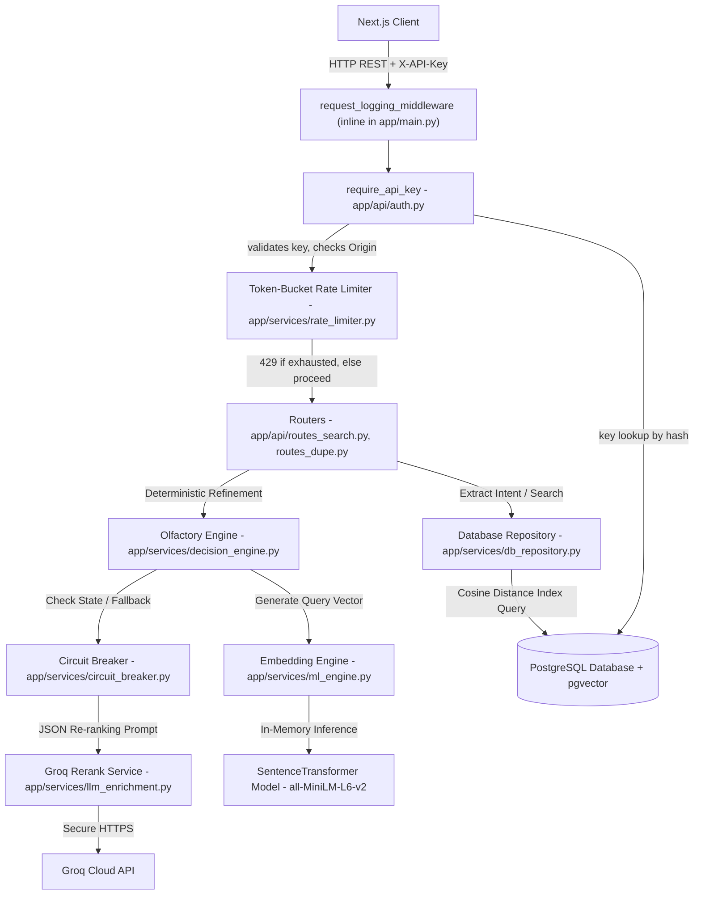

# AuraMatch AI - System Architecture and Component Guide

This document provides a detailed description of the system architecture, component boundaries, files, database schema, indexing structures, and deployment topologies of AuraMatch AI.

---

## 1. Executive Summary and System Boundaries

AuraMatch AI is designed as a decoupled, multi-tier web application built to serve semantic search, duplicate scent analysis, and olfactory classification tasks. The system is split into three distinct layers:
*   **Presentation Layer (Next.js)**: A React-based web client running on Next.js 16 (App Router), employing TypeScript and dynamic styling to handle user queries, result visualization, and scent profile analysis. See [FRONTEND_ARCHITECTURE.md](FRONTEND_ARCHITECTURE.md) for the page-by-page breakdown.
*   **Application Services Layer (FastAPI)**: A high-performance Python backend serving REST APIs, managing database access pools, executing vector searches, running deterministic scoring routines, and orchestrating external LLM calls.
*   **Persistence and Machine Learning Tier**: A PostgreSQL database containerized with the `pgvector` and `pg_trgm` extensions, operating alongside an in-memory vector embedding model (`all-MiniLM-L6-v2`) and an external re-ranking processor (Groq API).

---

## 2. Component Diagram and Network Topology

The diagram below illustrates how client queries flow through web routing, database connections, local machine learning models, and external APIs.

Every request to a product route passes through the auth dependency and rate limiter *before* reaching business logic - see [THIRD_PARTY_API.md](THIRD_PARTY_API.md) for the two-tier key model this enables. `GET /api/v1/health` is the one route that bypasses `AuthDep` entirely (standard liveness-probe convention).

---

## 3. Directory and File-by-File Architectural Breakdown

### 3.1 Frontend Web Client
The React application is located under the `frontend/` directory. It uses Next.js 16 App Router patterns.
*   `frontend/src/app/page.tsx`: The landing page - hero and entry point into `/search`.
*   `frontend/src/app/search/page.tsx`: The one search surface, built as a conversational chat interface (message list, free-text input, quick-reply chips) rather than a filter form. Guides an under-specified query through up to 9 clarifying questions, extracts preferences already stated in free text, and persists every conversation (not just the latest) to `localStorage` so a saved chat survives a closed tab. Handles both open-ended "vibe" queries and dupe/reference queries ("cheaper alternative to X") through the same input and the same backend endpoint - see [FRONTEND_ARCHITECTURE.md §4](FRONTEND_ARCHITECTURE.md).
*   `frontend/src/app/perfume/[id]/page.tsx`: The detail visualization page for a selected perfume. Displays metadata, launch years, country of origin, scent pyramid tiers (flagging inferred-from-accords pyramids via `has_limited_data`), and a "Find Dupes" action that opens `/search` pre-filled with a reference query.
*   `frontend/src/app/dupe/page.tsx`: **Redirect shim, not a real page anymore** - the standalone Dupe Engine form was folded into `/search` once the backend could detect dupe intent within the same endpoint. Kept only so pre-existing `/dupe?name=X` links still resolve, by translating `?name=` into `/search?prefill=...`.
*   `frontend/src/app/admin/page.tsx`: Ops metrics dashboard - parses the `/metrics` Prometheus export client-side; not linked from the public nav.
*   `frontend/src/lib/api.ts`: Centralizes type contracts (`Perfume`, `PerfumeDetail`) and HTTP fetch abstractions (`searchByContext`, `searchByDupe`, `getPerfumeById`, `checkHealth`, `getMetrics`).

### 3.2 Backend Service Layers
The Python backend is located under the `backend/` directory.

**Entry point, middleware, config:**
*   `backend/app/main.py`: Application entrypoint. Defines the request-logging middleware *inline* (`request_logging_middleware`, decorated with `@app.middleware("http")` - there is no separate `middleware.py` file), registers CORS with a restrictive origin allowlist, wires the `lifespan` context manager (warms the DB pool + embedding model + scenario embeddings at boot so the first real request isn't the one paying startup cost), and mounts both routers.
*   `backend/app/core/config.py`: Pydantic-settings `Settings` class (`.env`-driven) - DB URL, model name, CORS origins, optional Groq key, and the feature-flag mechanism (`feature_flags`/`is_feature_enabled`).
*   `backend/app/core/logging_config.py`: `setup_logging()` and the `request_id_var` ContextVar + `RequestIdFilter` that tags every log line emitted anywhere during a request with that request's ID, without threading the ID through every function call manually.

**API layer:**
*   `backend/app/api/routes_search.py`: `POST /api/v1/search/context` (natural-language + filter search) and `GET /api/v1/health`.
*   `backend/app/api/routes_dupe.py`: `POST /api/v1/search/dupe` (budget-alternative search) and `GET /api/v1/perfume/{id}`.
*   `backend/app/api/auth.py`: `require_api_key` FastAPI dependency - validates the `X-API-Key` header against the hashed `api_keys` table, enforces the Origin allowlist for publishable keys, and applies per-key rate limiting. Mounted on every product route except `/health`.
*   `backend/app/api/dependencies.py`: `get_db_pool()`/`get_db()` - lazy-initialized, lock-guarded asyncpg connection pool shared across the app.
*   `backend/app/models/schemas.py`: Pydantic request/response schemas representing the API's validation boundary.

**Domain services:**
*   `backend/app/services/db_repository.py`: Isolates execution of raw SQL queries. Coordinates connection pooling, vector parsing, GIN array exclusion pushdowns, and dynamically falls back to accord classification when notes are absent in the database.
*   `backend/app/services/decision_engine.py`: The core of the matching algorithm. Executes score calculations, scenario mappings, chemical bridge checks, concentration performance updates, and unisex gender bias modifiers - see [DECISION_ENGINE.md](DECISION_ENGINE.md).
*   `backend/app/services/intent_detector.py`: A deterministic regex and keyword parser that extracts intent (e.g. longevity, budget, sillage, gender, negation) from the raw input string before query execution.
*   `backend/app/services/ml_engine.py`: Manages vector embedding operations. Loads the local SentenceTransformer model on startup and runs async thread-pool executors to ensure model calculations do not block the asyncio web loop.
*   `backend/app/services/circuit_breaker.py`: Generic async circuit breaker (CLOSED/OPEN/HALF_OPEN) wrapping the optional Groq call - trips after 5 consecutive failures, so an outage becomes an instant rejection instead of a repeated timeout tax.
*   `backend/app/services/rate_limiter.py`: In-memory token-bucket rate limiter keyed per API key (and per-client-IP for publishable keys specifically) - see [THIRD_PARTY_API.md](THIRD_PARTY_API.md).
*   `backend/app/services/llm_enrichment.py`: Interfaces with the Groq API using prompt formatting to generate natural language explanations and feature checklist verifications.
*   `backend/app/services/scenario_map.py`: Holds the static note-to-family taxonomy maps, scenario word bounds, and longevity/sillage accord weights.

**Data ingestion and schema evolution** (see [DATA_INGESTION_PIPELINE.md](DATA_INGESTION_PIPELINE.md) for the full rationale):
*   `backend/app/ingestion/`: `contracts.py` (the canonical `PerfumeRecord` any data source normalizes into), `validators.py` (quality gate), `upsert.py` (priority-aware conditional upsert, replacing a silent-drop `ON CONFLICT DO NOTHING`).
*   `backend/app/db/migrations/`: Alembic migration history (`0001_baseline` through `0004_api_keys`) - the sole source of truth for schema changes going forward, applied automatically on container startup via `backend/entrypoint.sh` before `uvicorn` starts.

---

## 4. Persistence Layer Architecture and Vector Search

The database tier is designed to support high-dimensional similarity matching combined with strict categorical array filtering.

### 4.1 SQL Indexing Schemes
*   **HNSW (Hierarchical Navigable Small World)**:
    An HNSW index (`idx_perfumes_embedding`) is built on the `embedding` column using the `vector_cosine_ops` operator class. 
    *   **Parameters**: The index is configured with $M=16$ (number of bi-directional links per node) and `ef_construction=200` (size of the dynamic candidate list evaluated during index builds).
    *   **Why**: HNSW provides logarithmic search scaling. Standard flat vector indexes fall back to sequential scans, which stall when candidate datasets scale past 10,000 records.
*   **GIN (Generalized Inverted Index)**:
    GIN indexes are established on the `notes` and `main_accords` array columns.
    *   **Why**: GIN indexing decomposes arrays into distinct index entries, allowing Postgres to resolve array containment operators (`&&`) in $O(\log N)$ time rather than conducting full-table scans. This is used for SQL-level negation pushdown filters.
*   **Trigram (pg_trgm)**:
    GIN Trigram indexes are configured on `brand` and `perfume` text columns.
    *   **Why**: Trigrams split string tokens into overlapping three-character slices, allowing fast, index-accelerated case-insensitive similarity matching (`LIKE` or similarity operators) when searching for parent perfumes in the duplicate engine.

---

## 5. Network Topology and Deployment Model

All three services (`db`, `backend`, `frontend`) sit on one custom Docker bridge network (`auramatch_net`, `docker-compose.yml`) and address each other by service name (e.g. the backend's `DATABASE_URL` targets host `db`, not `localhost`).

*   **Host port exposure (current dev setup)**: `frontend:80`→host `3000`, `backend:8000`→host `8000`, `db:5432`→host `5434`. All three are published to the host today because this is a local/dev-oriented Compose file, not a hardened production topology - a real production deployment would keep `db` unpublished (backend-only access over the internal network) and expose only `frontend` (with `backend` reachable exclusively through it or a reverse proxy), but that's a deployment-environment decision, not something this Compose file itself needs to enforce for local development and review.
*   **Security restrictions actually in place today**: both the backend and frontend containers run as non-root users (`appuser`/`nextjs`, set explicitly in each Dockerfile); the Postgres data volume (`pgvector_data`) persists across container recreation (`docker compose up`/`restart`) and is only destroyed by an explicit `docker compose down -v`; CORS on the backend uses an explicit origin allowlist with `allow_credentials=False` (no cookies/sessions exist anywhere in this app, so there's nothing for a cross-origin request to steal); and every product API route additionally requires a valid `X-API-Key` (see [THIRD_PARTY_API.md](THIRD_PARTY_API.md)) - CORS alone only restricts *browser*-originated requests, so the API-key layer is what actually gates a direct/server-to-server caller.
*   **Startup ordering**: `backend` declares `depends_on: db: condition: service_healthy`, so it only starts once Postgres's healthcheck passes - and `backend/entrypoint.sh` runs `alembic upgrade head` before `uvicorn` starts, so a genuinely fresh `docker compose up` (no manual migration step) ends up fully migrated and query-ready, not just "the container is running."

---

## 6. Architecture Roadmap: What's Next, In What Order, And Why

An earlier draft of this project's architecture considered a generic "enterprise" blueprint - full hexagonal ports-and-adapters, a Redis multi-tier semantic cache, a complete OpenTelemetry distributed-tracing mesh, CQRS with a message queue. That blueprint was deliberately **not** built wholesale: none of it was motivated by anything concrete in this system as it actually exists (one Postgres instance, one local embedding model, one backend process, no measured production load). Building it anyway would have been the opposite of good system design - complexity added because a pattern exists, not because a real constraint demands it.

What *is* real: this system is deliberately built to evolve past a static, batch-seeded demo into ingesting live data from multiple sources, real e-commerce (checkout, live pricing), user accounts, and admin tooling. The roadmap below reflects that actual trajectory, sequenced by genuine prerequisite order - each phase is scoped to the minimum correct foundation for what's coming next, not maximum architectural coverage:

| Phase | Status | What | Why this order |
| :--- | :--- | :--- | :--- |
| 0 | **Done** | Alembic schema migrations + DB backup script | The only way to change schema was previously "delete the volume and reseed" - impossible the moment any non-reseedable row (a user, an order) exists. Had to land before anything else on this list. |
| 1 | **Done** | Ingestion pipeline hardening (`app/ingestion/`) - canonical record contract, quality-gate validators, priority-aware conditional upsert | Fixed two real bugs a live/multi-source ingestion pipeline would have hit immediately: a silent-drop `ON CONFLICT DO NOTHING`, and an unpersisted source-priority invariant that a one-row-at-a-time live upsert had no way to check. |
| 6 | **Done** | Two-tier API key auth (publishable/secret) + token-bucket rate limiting | Promoted ahead of its original position once this API needed to be genuinely usable by third-party integrators, not just documented as a policy. Solves a real, specific constraint: the frontend calls the API directly from the browser with no server-side proxy, so it can never hold a real secret. |
| 2 | **Done** | A `/metrics` Prometheus endpoint (`prometheus_client`) - latency histograms (by route template + status), error counter, DB pool gauge, circuit-breaker state gauge, rate-limit rejection counter | Small, standard, and the actual prerequisite for ever justifying a caching layer later - real numbers are needed before knowing whether there's a latency problem worth caching for. Landed right after the ANN candidate pool was widened up to 5-20x (`db_repository._candidate_pool_size`), which is exactly the kind of change this endpoint exists to measure the real-world impact of. See [TESTING_AND_OBSERVABILITY.md §5](TESTING_AND_OBSERVABILITY.md). |
| 3 | Roadmap | Commerce-readiness data model - a `listings` table (retailer, price, url, last_checked_at) separate from the perfume's own row | Splits "the perfume" (content) from "where/how much it costs" *before* live pricing/checkout needs multiple retailers per perfume, avoiding a bolt-on redesign later. |
| 4 | Roadmap | Auth foundation - `users` table, session/JWT middleware, `/api/v1/me/*` convention | Plumbing only, built when user-facing features (saved searches, favorites) actually need it - not speculatively ahead of that need. |
| 5 | Roadmap | Admin/ops trust boundary - `/api/v1/admin/*`, role-gated, audit log | Supports reviewing imported/ingested data and approving changes once ingestion volume makes that a real human workflow, not a hypothetical one. |

**Still explicitly not planned, with reasoning** (this list matters as much as the roadmap itself): full hexagonal architecture (no second real adapter to swap - one DB, one model host); Redis/multi-tier caching (no measured load problem yet - Phase 2 is what would ever produce that evidence); CQRS/message-queue write side (ingestion already runs as a separate process from serving; a queue is unjustified until ingestion volume/frequency actually creates contention); a full OpenTelemetry tracing mesh (earns its keep across many services/hops - there's one backend service today, and Phase 2's metrics endpoint is the proportionate step before that).
