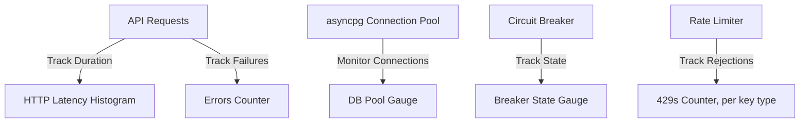

# AuraMatch AI - Testing & Observability Guide

This document details the testing architecture, mock configurations, logging middlewares, and telemetry endpoints implemented within AuraMatch AI.

---

## 1. Quality Assurance and Testing Philosophy

AuraMatch AI uses a comprehensive test suite to ensure the system is stable, matches are accurate, and edge cases are handled correctly.
*   **Decoupled Test Runs**: The test suite can run in environments without database configurations. Inbound validation and decision engine calculations are isolated from network latency and external APIs.
*   **Fast Verification cycles**: Unit tests use lightweight fakes and mock objects to execute in seconds, providing fast feedback loops.
*   **High Regression Coverage**: Tests verify bug fixes (such as substring note overlaps, negation extraction edge cases, and unisex gender bias modifiers) to ensure they are not reintroduced during code changes.

---

## 2. Test Suite Directory and File Architecture

The backend test suite is located in `backend/tests/` and contains **287 unit and integration tests**:

### 2.1 Test File Breakdown
*   `tests/test_auth.py`: Tests the `require_api_key` dependency (publishable vs. secret key validation, revocation, Origin allowlist enforcement, rate-limit rejection, and the `auramatch_rate_limit_rejections_total` metric incrementing on a real 429) against a fake connection double, plus an end-to-end wiring test on a throwaway FastAPI app.
*   `tests/test_circuit_breaker.py`: Tests the circuit breaker state machine, verifying transitions from `CLOSED` to `OPEN` after repeated errors, and from `OPEN` to `HALF-OPEN` after the timeout expires.
*   `tests/test_db_repository.py`: Tests database queries, including ANN candidate selection and GIN array exclusions, the accord-tier fallback pipeline, corrupted-notes cleaning (`_clean_notes`, including on the reference-perfume lookup path), the `has_limited_data` flag, and `find_reference_perfume`'s brand-ambiguity guard (`_is_same_brand_group`) against a fake connection double simulating all four lookup tiers.
*   `tests/test_decision_engine.py`: Verifies match score calculations, dynamic weight rescaling, chemical bridge fits, sillage/longevity scaling, unisex gender modifiers, and the brand/scent-character diversity caps (`cap_per_brand`, `cap_by_scent_character`, including the `limit < max_per_key` backfill-ceiling regression).
*   `tests/test_ingestion.py`: Tests the Pydantic ingestion contracts, validation logic, case-insensitive normalized duplicate lookups, and source-priority updates.
*   `tests/test_intent_detector.py`: Tests the conversational intent parser, verifying gender extraction, budget limit checks, sillage keywords, and negation boundaries.
*   `tests/test_llm_enrichment.py`: Verifies Groq API integration boundaries, mock payloads, and circuit breaker exception handling.
*   `tests/test_metrics.py`: Tests the circuit-breaker-state-to-gauge-value mapping (`set_circuit_breaker_gauge`) in `app/core/metrics.py`.
*   `tests/test_middleware.py`: Verifies HTTP request-logging middleware in isolation, plus the metrics it records - the latency histogram, the failure counter, and that the `route` label uses the matched route's path template (not the resolved path with real values substituted in).
*   `tests/test_rate_limiter.py`: Tests the token-bucket rate limiter in isolation - token consumption, continuous refill, and a concurrent-race test proving the per-bucket lock prevents over-consumption.
*   `tests/test_scenario_map.py`: Verifies notes-to-family taxonomy mapping and the note classification parser.
*   `tests/test_schemas.py`: Tests Pydantic model schemas, verifying validation boundaries.
*   `tests/test_preference_extractor.py`: Tests the 3-layer preference extraction service orchestrating local regexes, semantic cosine scenario matches, and Groq fallback.

### 2.2 Frontend E2E Test Suite (Playwright)
The frontend E2E test suite is located in `frontend/e2e/` and runs Playwright integration tests:
- `frontend/e2e/search.spec.ts`: Tests the full conversational flow and search capabilities of AuraMatch AI. This includes verifying page loads, entering detailed queries to immediately load results, typing vague queries and clicking through all 9 clarifying questions, handling off-topic boundaries, and verifying connection error behavior. All E2E tests run against the unmocked live Docker containers (backend + database) to ensure production fidelity.

---

## 3. Mocking and Test Isolation Strategies

### 3.1 Database Connection Fake (`FakeConn`)
To avoid requiring a running PostgreSQL instance for unit-test runs, the ingestion tests use a lightweight connection double (`FakeConn`) inside `tests/test_ingestion.py`.
*   **Behavior**:
    *   Simulates `conn.fetchrow()` using dictionary key comparisons to mock exact (brand, perfume) database lookups.
    *   Simulates `conn.fetch()` to search by `normalized_key`.
    *   Intercepts `UPDATE` and `INSERT` SQL statements to update an in-memory database representation (`self.rows`).
*   **Result**: Validates upsert logic, priority checks, and duplicate resolution in memory.

### 3.2 External API Mocking
To avoid making real network requests to the Groq API during tests, the Groq client calls are mocked using Pytest's `monkeypatch` utility:
*   **Monkeypatching settings**: Overrides the `groq_api_key` configuration to isolate tests from local environment variables.
*   **Simulating failures**: Monkeypatches `llm_enrichment._call_groq` to raise exceptions (e.g. timeout errors) and verify that the circuit breaker opens after the failure threshold is reached.
*   **Simulating responses**: Simulates successful JSON payloads to verify that explanation values are parsed and mapped correctly to candidate records.

---

## 4. Web Service Observability Middleware

FastAPI request lifecycles are monitored by `request_logging_middleware`, defined *inline* in `backend/app/main.py` (there is no separate `middleware.py` file - it's registered directly on the `app` instance via `@app.middleware("http")`):
*   **Request ID correlation**: generates a 12-char request ID per request, stashed in a `ContextVar` (`app/core/logging_config.py`) rather than a local variable, so every log line emitted anywhere deeper in the call stack during that request - route handlers, services - is automatically tagged with it via `RequestIdFilter`, without threading an ID parameter through every function signature. The same ID is returned as an `X-Request-ID` response header, so a client-reported error can be traced back to the exact server-side log line.
*   **Structured JSON logging**: all log output is emitted as machine-parseable JSON via `structlog` with `JSONRenderer` (configured in `app/core/logging_config.py`). The structlog pipeline includes `merge_contextvars` (for request_id injection), `add_log_level`, `TimeStamper(fmt="iso")`, `StackInfoRenderer`, and `format_exc_info`. This replaces the earlier plain-text `%s %s -> %d (%.1fms)` format with a structured JSON envelope containing `event`, `request_id`, `level`, `timestamp`, and any additional bound context.
*   **Performance metrics**: measures request duration in milliseconds via `time.perf_counter()`.
*   **Exception safety**: a request that raises still gets a logged `-> 500` line (via `logger.exception`, capturing the traceback) before the exception propagates - a crash is never silently unlogged.

---

## 4.1 Failure Injection Middleware (Chaos Testing)

`backend/app/core/failure_injection.py` provides a `FailureInjectionMiddleware` registered in `app/main.py` for chaos-engineering validation:
*   **Activation**: only active when `failure_injection` is included in the `feature_flags` environment variable (comma-separated set). Disabled by default in production.
*   **Artificial latency**: injects random delays (configurable) into a fraction of requests to simulate slow-not-down failure modes.
*   **Random errors**: returns simulated `500 Internal Server Error` responses for a configurable fraction of requests (`{"detail": "Simulated failure (chaos testing)"}`).
*   **Purpose**: validates that circuit breakers, retry logic, and frontend error-handling paths behave correctly under degraded conditions without requiring real infrastructure failures.

---

## 5. Observability Metrics Endpoint (`GET /metrics`)

`GET /metrics` (app/main.py, backed by `app/core/metrics.py`) is a Prometheus-format scrape target - Phase 2 of the architecture roadmap (see [SYSTEM_ARCHITECTURE.md §6](SYSTEM_ARCHITECTURE.md)), now implemented. It's deliberately scoped small and concrete - request latency, error rates, DB pool utilization, circuit-breaker state - rather than a full tracing mesh, because a full OpenTelemetry distributed-tracing setup earns its keep across many services/hops, and this system has one backend service today. This is also the actual prerequisite for ever justifying a caching layer: real numbers are needed before knowing whether there's a latency problem worth caching for at all - the pool-size widening in `db_repository._candidate_pool_size` (up to 1,000 ANN candidates, from an earlier 50/200 cap) is exactly the kind of change this endpoint exists to measure the real-world impact of.

Unauthenticated, same convention as `/health`: a Prometheus scrape target is meant to be polled by infrastructure, not called by product clients, and exposes only aggregate counters/gauges - no user or request-content data.

### Metrics Schema:
*   `auramatch_http_request_duration_seconds` (Histogram): HTTP request latencies, labeled by `route` and `status`. Recorded once per request in `request_logging_middleware` (app/main.py) - the one place every request, successful or not, already passes through exactly once. `route` is the matched route's path *template* (e.g. `/api/v1/perfume/{perfume_id}`), read from `request.scope["route"]` after routing has resolved it - never the literal resolved path, which would give every distinct perfume ID its own label series (unbounded cardinality that gets worse forever as the catalog/traffic grows). Falls back to the raw path only for requests that never matched a route at all (a genuine 404 with no route).
*   `auramatch_http_requests_failed_total` (Counter): requests that raised an unhandled exception, labeled by `route`. Deliberately distinct from a normal 4xx/5xx status in the histogram above - an `HTTPException(404)` or `HTTPException(429)` is an intentional, handled response, not a crash, and doesn't increment this.
*   `auramatch_db_pool_connections_active` (Gauge, labeled `state="active"|"idle"`): asyncpg pool utilization, read fresh at scrape time (`pool.get_size() - pool.get_idle_size()` / `pool.get_idle_size()`) inside the `/metrics` handler itself - polling once per scrape is simpler and just as accurate as keeping a gauge continuously in sync on every acquire/release.
*   `auramatch_circuit_breaker_state` (Gauge, labeled `breaker="groq"`): the Groq circuit breaker's state (0=CLOSED, 1=OPEN, 2=HALF_OPEN), read from `llm_enrichment.get_groq_breaker_state()` at scrape time - same real state machine `app/services/circuit_breaker.py` already ran, now exported.
*   `auramatch_rate_limit_rejections_total` (Counter, labeled `key_type`): incremented in `app/api/auth.py` at the exact point a 429 is raised, so it's always in sync with what a caller actually experienced.

Deliberately **not** built: a semantic-cache hit-ratio metric. There is no caching layer in this system, and won't be one until the metrics above actually show a latency problem worth solving that way - see the architecture roadmap's "explicitly not planned" list for the full reasoning.

**`/admin` (frontend, `frontend/src/app/admin/page.tsx`)**: a small dashboard that fetches the raw `/metrics` text export and parses it client-side into summary cards (total requests, failed requests, rate-limit rejections, circuit-breaker state) and a per-route latency/status table, plus a collapsible raw-text viewer. It's a consumer of `/metrics`, not a replacement for real Prometheus/Grafana - reachable only by direct URL (not linked from the public nav), matching `/metrics` itself being unauthenticated-but-not-advertised.

---

## 6. Scope of Observability Scaling and Future Expansion

*   **Distributed Tracing (OpenTelemetry)**: correlating a request ID across the Next.js client, API routes, database queries, and the Groq call would be the natural next step *after* the metrics endpoint above, and specifically once there's more than one backend service/process for a trace to actually correlate across - not before.
*   **Alerting Rules**: Prometheus alerting (error-rate spikes, backend latency exceeding a threshold, DB pool exhaustion) is a direct, low-effort follow-on once the metrics endpoint exists to alert on - not useful to configure before there's anything to configure it against.
