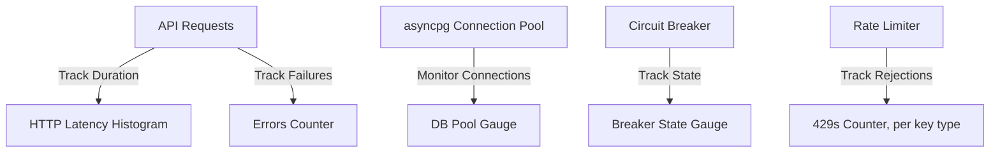

# AuraMatch AI - Testing & Observability Guide

This document details the testing architecture, mock configurations, logging middlewares, and telemetry endpoints implemented within AuraMatch AI.

---

## 1. Quality Assurance and Testing Philosophy

AuraMatch AI uses a comprehensive test suite to ensure the system is stable, matches are accurate, and edge cases are handled correctly.
*   **Decoupled Test Runs**: The test suite can run in environments without database configurations. Inbound validation and decision engine calculations are isolated from network latency and external APIs.
*   **Fast Verification cycles**: Unit tests use lightweight fakes and mock objects to execute in seconds, providing fast feedback loops.
*   **High Regression Coverage**: Tests verify bug fixes (such as substring note overlaps, negation extraction edge cases, and unisex gender bias modifiers) to ensure they are not reintroduced during code changes.

---

## 2. Test Suite Directory and File Architecture

The backend test suite is located in `backend/tests/` and contains **210 unit and integration tests**:

### 2.1 Test File Breakdown
*   `tests/test_auth.py`: Tests the `require_api_key` dependency (publishable vs. secret key validation, revocation, Origin allowlist enforcement, rate-limit rejection) against a fake connection double, plus an end-to-end wiring test on a throwaway FastAPI app.
*   `tests/test_circuit_breaker.py`: Tests the circuit breaker state machine, verifying transitions from `CLOSED` to `OPEN` after repeated errors, and from `OPEN` to `HALF-OPEN` after the timeout expires.
*   `tests/test_db_repository.py`: Tests database queries, including ANN candidate selection and GIN array exclusions, as well as the accord-tier fallback pipeline.
*   `tests/test_decision_engine.py`: Verifies match score calculations, dynamic weight rescaling, chemical bridge fits, sillage/longevity scaling, and unisex gender modifiers.
*   `tests/test_ingestion.py`: Tests the Pydantic ingestion contracts, validation logic, case-insensitive normalized duplicate lookups, and source-priority updates.
*   `tests/test_intent_detector.py`: Tests the conversational intent parser, verifying gender extraction, budget limit checks, sillage keywords, and negation boundaries.
*   `tests/test_llm_enrichment.py`: Verifies Groq API integration boundaries, mock payloads, and circuit breaker exception handling.
*   `tests/test_middleware.py`: Verifies HTTP request-logging middleware in isolation.
*   `tests/test_rate_limiter.py`: Tests the token-bucket rate limiter in isolation - token consumption, continuous refill, and a concurrent-race test proving the per-bucket lock prevents over-consumption.
*   `tests/test_scenario_map.py`: Verifies notes-to-family taxonomy mapping and the note classification parser.
*   `tests/test_schemas.py`: Tests Pydantic model schemas, verifying validation boundaries.

---

## 3. Mocking and Test Isolation Strategies

### 3.1 Database Connection Fake (`FakeConn`)
To avoid requiring a running PostgreSQL instance for unit-test runs, the ingestion tests use a lightweight connection double (`FakeConn`) inside `tests/test_ingestion.py`.
*   **Behavior**:
    *   Simulates `conn.fetchrow()` using dictionary key comparisons to mock exact (brand, perfume) database lookups.
    *   Simulates `conn.fetch()` to search by `normalized_key`.
    *   Intercepts `UPDATE` and `INSERT` SQL statements to update an in-memory database representation (`self.rows`).
*   **Result**: Validates upsert logic, priority checks, and duplicate resolution in memory.

### 3.2 External API Mocking
To avoid making real network requests to the Groq API during tests, the Groq client calls are mocked using Pytest's `monkeypatch` utility:
*   **Monkeypatching settings**: Overrides the `groq_api_key` configuration to isolate tests from local environment variables.
*   **Simulating failures**: Monkeypatches `llm_enrichment._call_groq` to raise exceptions (e.g. timeout errors) and verify that the circuit breaker opens after the failure threshold is reached.
*   **Simulating responses**: Simulates successful JSON payloads to verify that explanation values are parsed and mapped correctly to candidate records.

---

## 4. Web Service Observability Middleware

FastAPI request lifecycles are monitored by `request_logging_middleware`, defined *inline* in `backend/app/main.py` (there is no separate `middleware.py` file - it's registered directly on the `app` instance via `@app.middleware("http")`):
*   **Request ID correlation**: generates a 12-char request ID per request, stashed in a `ContextVar` (`app/core/logging_config.py`) rather than a local variable, so every log line emitted anywhere deeper in the call stack during that request - route handlers, services - is automatically tagged with it via `RequestIdFilter`, without threading an ID parameter through every function signature. The same ID is returned as an `X-Request-ID` response header, so a client-reported error can be traced back to the exact server-side log line.
*   **Performance metrics**: measures request duration in milliseconds via `time.perf_counter()`.
*   **Exception safety**: a request that raises still gets a logged `-> 500` line (via `logger.exception`, capturing the traceback) before the exception propagates - a crash is never silently unlogged.

```
Actual log line format (logger.info/.exception, not a JSON blob):
%s %s -> %d (%.1fms)
e.g.: POST /api/v1/search/context -> 200 (184.3ms)
```

---

## 5. Observability Metrics Endpoint Roadmap (Not Yet Built)

A `/metrics` Prometheus-format endpoint (`prometheus_client`) is the next planned observability step (Phase 2 of the architecture roadmap - see [SYSTEM_ARCHITECTURE.md §6](file:///c:/Users/SHRIYASH%20SAWANT/OneDrive/Desktop/JTP-PROJECT%20ROUND/documentation/SYSTEM_ARCHITECTURE.md)), not yet implemented. It's deliberately scoped small and concrete - request latency, error rates, DB pool utilization, circuit-breaker state - rather than a full tracing mesh, because a full OpenTelemetry distributed-tracing setup earns its keep across many services/hops, and this system has one backend service today. This metrics endpoint is also the actual prerequisite for ever justifying a caching layer: real numbers are needed before knowing whether there's a latency problem worth caching for at all.



### Planned Metrics Schema:
*   `auramatch_http_request_duration_seconds` (Histogram): HTTP request latencies, segmented by route and response status.
*   `auramatch_http_requests_failed_total` (Counter): request failures, segmented by route.
*   `auramatch_db_pool_connections_active` (Gauge): active vs idle connection counts in the asyncpg pool.
*   `auramatch_circuit_breaker_state` (Gauge): the Groq circuit breaker's state (0=CLOSED, 1=OPEN, 2=HALF_OPEN) - already a real, implemented state machine (`app/services/circuit_breaker.py`), just not yet exported as a metric.
*   `auramatch_rate_limit_rejections_total` (Counter): 429 rejections, segmented by key type (publishable/secret) - the rate limiter (`app/services/rate_limiter.py`) already tracks this internally per-bucket, just not yet exported as a metric.

Deliberately **not** planned: a semantic-cache hit-ratio metric. There is no caching layer in this system, and won't be one until the metrics above actually show a latency problem worth solving that way - see the architecture roadmap's "explicitly not planned" list for the full reasoning.

---

## 6. Scope of Observability Scaling and Future Expansion

*   **Distributed Tracing (OpenTelemetry)**: correlating a request ID across the Next.js client, API routes, database queries, and the Groq call would be the natural next step *after* the metrics endpoint above, and specifically once there's more than one backend service/process for a trace to actually correlate across - not before.
*   **Alerting Rules**: Prometheus alerting (error-rate spikes, backend latency exceeding a threshold, DB pool exhaustion) is a direct, low-effort follow-on once the metrics endpoint exists to alert on - not useful to configure before there's anything to configure it against.
